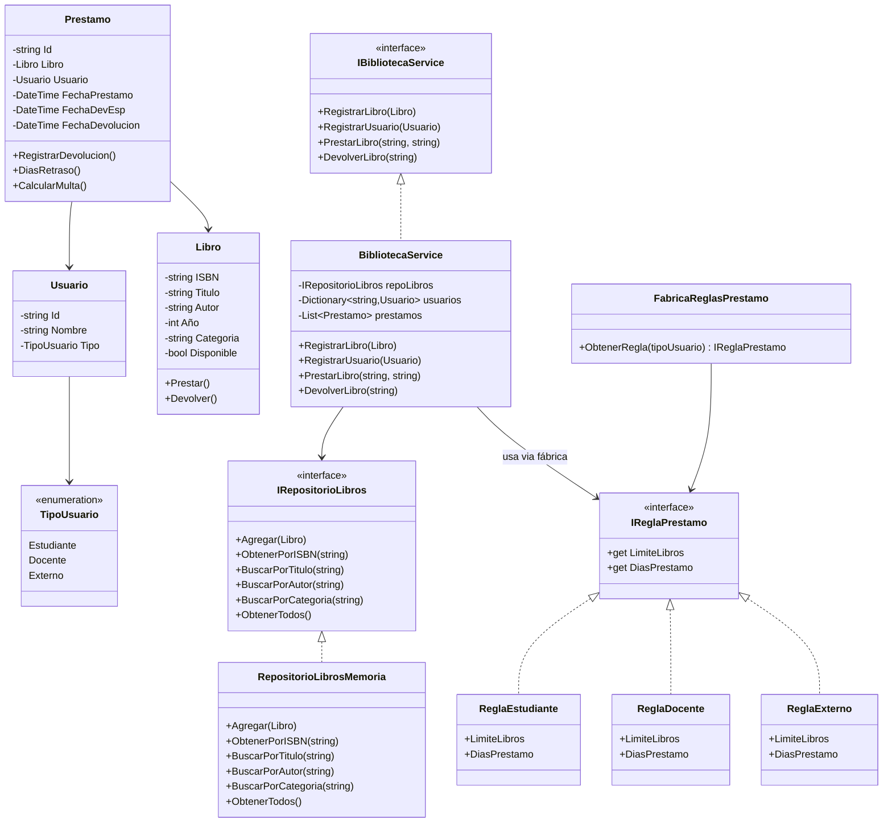
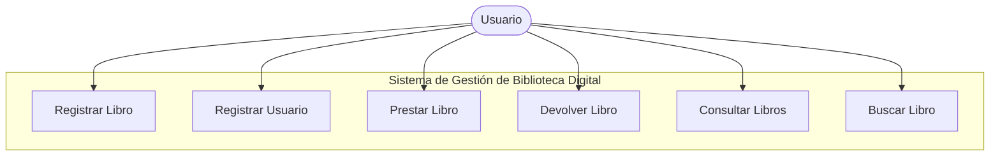
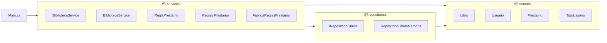

## SRP (Single Responsibility):

`Libro`, `Usuario`, `Prestamo` solo contienen datos y lógica pequeña propia.

`RepositorioLibrosEnMemoria` solo gestiona persistencia.

`BibliotecaService` contiene la lógica del negocio (préstamo/devolución) y delega acceso a repositorios.

## DIP (Dependency Inversion):

`BibliotecaService` depende de la abstracción `IRepositorioLibros`.

En `Program/Main` inyectamos la implementación concreta `RepositorioLibrosEnMemoria` (inyección manual).

## OCP (Open/Closed):

`IReglaPrestamo` define la estructura y cada Regla `ReglaEstudiante.cs, ReglaDocente.cs y ReglaExterno.cs` La utiliza pero no la modifican.

| Principio SOLID | Clase/Archivo donde se aplica | Ejemplo concreto | Justificación |
| :---: | :---: | :---: | :---: |
| SRP | `Libro.cs` | La clase solo gestiona su propio estado: Prestar(), Devolver() y sus atributos. . | La clase solo tiene una razón válida para cambiar: reglas internas del comportamiento de un libro. No contiene lógica de préstamos ni de usuarios. |
| | `Usuario.cs` | Contiene únicamente datos del usuario (Id, Nombre, Tipo). | Cambia solo si se modifican los datos del usuario. No carga lógica de negocio. |
| | `RepositorioLibrosMemoria.cs` | Solo se encarga del almacenamiento y consulta de libros en memoria. | Si cambia la forma de persistencia, solo cambia el repositorio, no el dominio ni los servicios. |
| | `BibliotecaService.cs` | Contiene solo lógica de negocio (prestamos y devoluciones). | Si cambian reglas de negocio, solo se modifica esta clase, no el dominio ni los repositorios. |
| OCP | `IReglaPrestamo.cs` | Interfaz define: `int LimiteLibros`, `int DiasPrestamo` | Se puede extender con nuevas reglas sin modificar el código existente. |
| | `ReglaEstudiante.cs`   `ReglaDocente.cs`   `ReglaExterno.cs` | Cada clase implementa distintas políticas de préstamo. | Para añadir un nuevo tipo (p. ej. “Administrador”), solo creas una nueva clase que implemente IReglaPrestamo → NO se modifica el servicio.|
| | `FrabricaReglasPrestamo.cs` | Devuelve la regla según el tipo. | Permite ampliar el sistema sin tocar `BibliotecaService`. |
| | `BibliotecaService.cs` | `var regla = FabricaReglasPrestamo.ObtenerRegla(usuario.Tipo);` | El servicio no sabe los detalles de las reglas → queda abierto a extensión y cerrado a modificación. |
| DIP | `IBibliotecaService.cs` | El servicio depende de una abstracción. | Permite sustituir implementaciones sin tocar la capa de negocio. |
| | `IRepositorioLibros.cs` | El repositorio es una interfaz. | El servicio usa solo la interfaz, no la implementación concreta. |
| | `Program.cs` | `var repoLibros = new RepositorioLibrosMemoria(); IBibliotecaService servicio = new BibliotecaService(repoLibros);` | Se cumple DIP porque la creación de dependencias está fuera del servicio. |
| | `FabricaReglasPrestamo.cs` | Devuelve una instancia de una regla basada en la abstracción `IReglaPrestamo`. | `BibliotecaService` depende de la interfaz, no de las clases concretas de reglas. |

